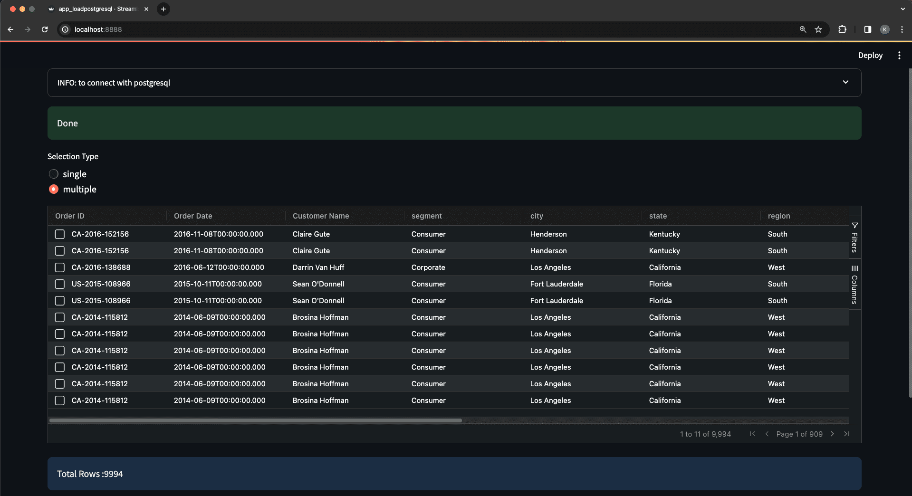
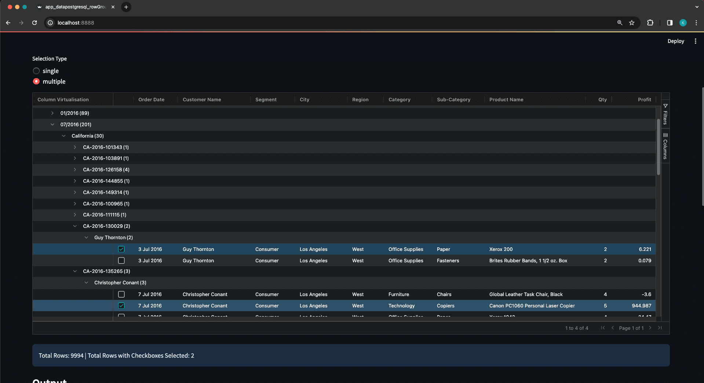
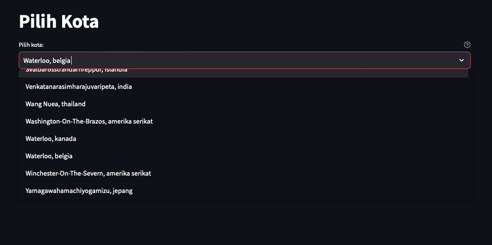

    

Streamlit

&nbsp;

&nbsp;

# PythonStreamlit-postgresql

&nbsp;

### Postgres dengan Docker Container

    ❯ docker run -d \
      --name postgres-container \
      -e POSTGRES_USER=postgres \
      -e POSTGRES_PASSWORD=postgres \
      -p 5432:5432 \
      -v /Users/powercommerce/Documents/test/docker-mount/postgres:/var/lib/postgresql/data \
      postgres:16.1

- Test akses ke database postgresql

      ❯ psql -h <HOST-IP> -U postgres -d Superstore

### in host :

    ❯ pg_dump --version
      pg_dump (PostgreSQL) 16.1 (Homebrew)

---

### [PG_DUMP postgresql]

- Backup per-table:

      ❯ pg_dump -h <HOST-IP> -U postgres -W -d Superstore -t tablestatecity -F c -f /<path-directories>/dbpostgres_Superstore_tablestatecity_backup_$(date +"%Y%m%d_%H%M%S").dump

- Backup per-database:

      ❯ pg_dump -h <HOST-IP> -U postgres -d Superstore -F c -f /<path-directories>/dbpostgres_Superstore_backup_$(date +"%Y%m%d_%H%M%S").dump

### [PG_RESTORE postgresql]

- Restore per-database

      ❯ pg_restore -h <HOST-IP> -U postgres -d Superstore /<path-directories>/dbpostgres_Superstore_backup_20240215_094515.dump

---

&nbsp;

&nbsp;

&nbsp;

&nbsp;

## BEGIN STREAMLIT PROJECT:

### References : 
components streamlit : --> https://components.streamlit.app

    ❯ cd <foldername-projects>

    ❯ python -m venv venv

    ❯ source ./venv/bin/activate

---

    ❯ pip install streamlit

    ❯ pip install streamlit-option-menu

    ❯ pip install streamlit-aggrid

---

### another packages for single compilations

    ❯ pip install opencv-python

    ❯ pip install qrcode

---

    ❯ pip install plotly 

    ❯ pip install openpyxl

    ❯ pip install matplotlib 

---

    ❯ pip install python-dotenv

    ❯ pip install psycopg2

    ❯ pip install sqlalchemy

---

### khusus untuk penggunaan Ubuntu 22.04 or latest

    ❯ python3 -m venv venvUbuntu

    ❯ source venvUbuntu/bin/activate

    ❯ pip install psycopg2-binary

    ❯ pip3 list | grep SQLAlchemy

        SQLAlchemy         2.0.25

### menjalankan project:

    ❯ streamlit run ./<nama-file>.py  --server.port 8888

---

### struktur files :

    ❯ tree -a -L 1 -I 'README.md|venv' ./ | grep -E '.py|.env'

        ├── .env
        ├── 1_app_loadpostgresql.py
        ├── 2_app_datapostgresql_rowGroup.py
        ├── 3_app_datapostgresql_selectbox.py
        ├── mydashboard.py

&nbsp;

    ❯ cat .env

        PGUSER=postgres
        PGPASSWORD=postgres
        PGPORT=5432

---

&nbsp;

### 1_app_loadpostgresql.py

    

    

&nbsp;

&nbsp;

### 2_app_datapostgresql_rowGroup.py

    

    

    

&nbsp;

&nbsp;

### 3_app_datapostgresql_selectbox.py

    

---

### mydashboard.py

    

&nbsp;

---

&nbsp;

&nbsp;

&nbsp;

&nbsp;

&#x1FAA7; Notes : 

    ❯ pip list

        Package                   Version
        ------------------------- ------------
        altair                    5.2.0
        attrs                     23.2.0
        blinker                   1.7.0
        cachetools                5.3.3
        certifi                   2024.2.2
        charset-normalizer        3.3.2
        click                     8.1.7
        contourpy                 1.2.0
        cycler                    0.12.1
        et-xmlfile                1.1.0
        fonttools                 4.49.0
        gitdb                     4.0.11
        GitPython                 3.1.42
        idna                      3.6
        importlib-metadata        7.0.1
        Jinja2                    3.1.3
        jsonschema                4.21.1
        jsonschema-specifications 2023.12.1
        kiwisolver                1.4.5
        markdown-it-py            3.0.0
        MarkupSafe                2.1.5
        matplotlib                3.8.3
        mdurl                     0.1.2
        numpy                     1.26.4
        opencv-python             4.9.0.80
        openpyxl                  3.1.2
        packaging                 23.2
        pandas                    2.2.1
        pillow                    10.2.0
        pip                       22.0.4
        plotly                    5.19.0
        protobuf                  4.25.3
        psycopg2                  2.9.9
        pyarrow                   15.0.0
        pydeck                    0.8.1b0
        Pygments                  2.17.2
        pyparsing                 3.1.2
        pypng                     0.20220715.0
        python-dateutil           2.9.0.post0
        python-decouple           3.8
        python-dotenv             1.0.1
        pytz                      2024.1
        qrcode                    7.4.2
        referencing               0.33.0
        requests                  2.31.0
        rich                      13.7.1
        rpds-py                   0.18.0
        setuptools                58.1.0
        six                       1.16.0
        smmap                     5.0.1
        SQLAlchemy                2.0.28
        streamlit                 1.31.1
        streamlit-aggrid          0.3.4.post3
        streamlit-option-menu     0.3.12
        tenacity                  8.2.3
        toml                      0.10.2
        toolz                     0.12.1
        tornado                   6.4
        typing_extensions         4.10.0
        tzdata                    2024.1
        tzlocal                   5.2
        urllib3                   2.2.1
        validators                0.22.0
        zipp                      3.17.0